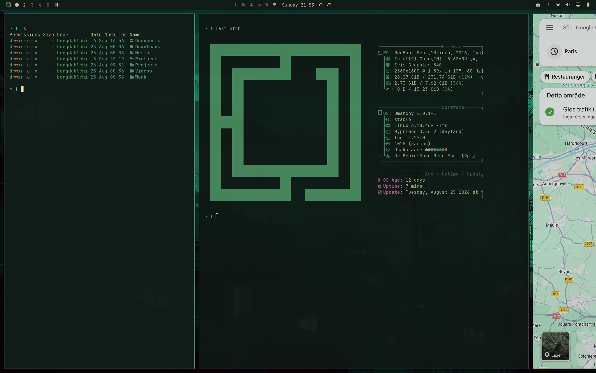
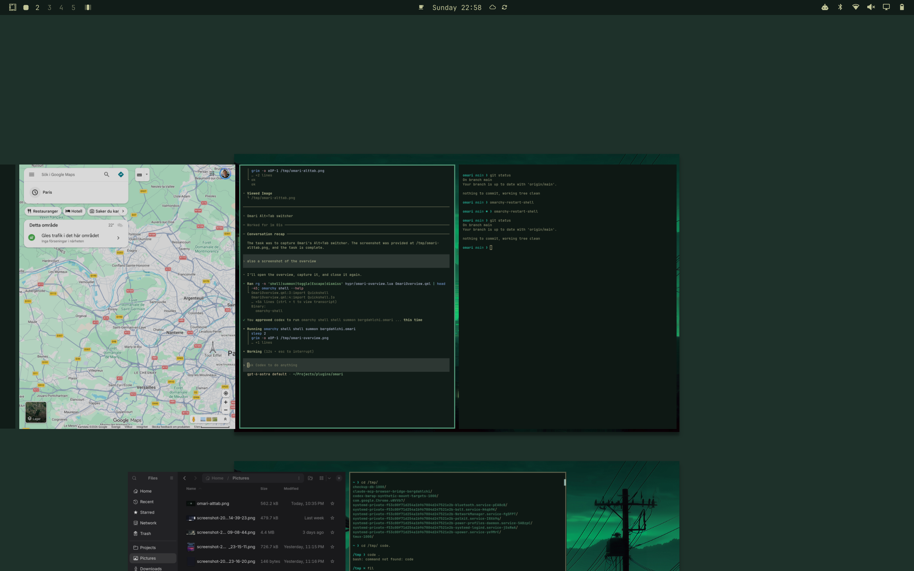
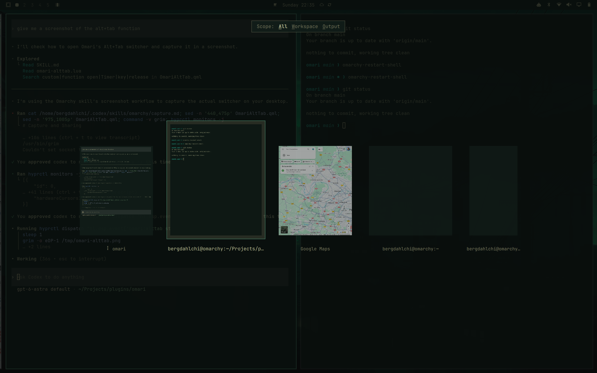

# Omari — Niri-inspired navigation for Omarchy

If you like the Niri wayland compositor but don't want to leave the cool world of Omarchy. Omari adds Niri-inspired scrolling, gestures, Workspace overview and Alt-Tab switcher of course styled with your Omarchy theme.

## Screenshots

### Scrolling desktop



### Workspace overview



### Alt-Tab switcher



## Requirements

- Omarchy with the Quattro shell and `omarchy plugin` commands.
- Hyprland with Lua configuration, the scrolling layout, gesture callbacks,
  `hl.timer`, and `hl.is_key_down` support (the Lua APIs used by this plugin).
- Omarchy's default Hyprland toggle loader (`default.hypr.toggles`).
- Quickshell with QtQuick, QtQuick.Controls, QtQuick.Effects, Quickshell.Io,
  Quickshell.Wayland, and Quickshell.Hyprland, plus Omarchy's `qs.Commons` and
  `qs.Ui` modules.
- Bash, coreutils, and `hyprctl`, supplied by Omarchy. A multitouch trackpad is
  needed for gestures; keyboard controls also work.

Older Hyprland installations using only `hyprland.conf` are not supported.
There is no Niri dependency, remote build, package installer, extra service,
network request, or privileged command. The plugin runs inside the existing
Omarchy shell process with your user permissions.

## Install

```sh
omarchy plugin add https://github.com/chicreativetech/omari.git --enable
omarchy bar move bergdahlchi.omari --section left
```

Click the Omari bar icon and turn on **Enable Omari**. This also enables
the overview and Alt-Tab; each can then be switched off separately.
Right-clicking the icon toggles the mode directly.

Enabling mode copies the three bundled `hypr/omari-*.lua` files into
`${XDG_STATE_HOME:-$HOME/.local/state}/omarchy/toggles/hypr/` and reloads
Hyprland. These files persist across login. They change the layout, gestures,
animations, and navigation bindings, including Omarchy's Alt-Tab bindings.
Review `hypr/` for the full configuration; custom bindings may conflict.
Existing configuration files are not edited.

## Controls

### Keyboard shortcuts

`SUPER` is the Windows/Command key. Enable the corresponding Omari feature
in the bar popup to use its shortcuts.

**Desktop navigation**

| Shortcut | Action |
| --- | --- |
| SUPER+Left / Right | Focus the previous / next window column |
| SUPER+Up / Down | Focus the window above / below within a column |
| SUPER+PageDown | Go to the next workspace |
| SUPER+PageUp | Go to the previous workspace |
| SUPER+ALT+O | Open the overview |
| ALT+Tab | Open the window switcher and select the next window |
| ALT+SHIFT+Tab | Open the window switcher and select the previous window |

**While the overview is open**

| Shortcut | Action |
| --- | --- |
| Up / Down | Select the previous / next workspace row |
| Left / Right | Select the previous / next window in the row |
| Enter or Space | Activate the selected window or empty workspace |
| SUPER+ALT+O | Activate the selection and close the overview |
| Escape | Cancel and return to the original desktop |

**While the Alt-Tab switcher is open**

Keep `ALT` held while browsing or changing the scope.

| Shortcut | Action |
| --- | --- |
| Tab / SHIFT+Tab | Select the next / previous window |
| Left / Right | Select the previous / next window |
| A | Show windows from all workspaces |
| W | Show windows from the current workspace |
| O | Show windows from the current display |
| Release ALT | Activate the selected window |
| Enter or Space | Activate the selected window immediately |
| Escape | Cancel without switching windows |

### Gestures and mouse

| Control | Action |
| --- | --- |
| Three-finger horizontal swipe | Scroll along window columns |
| Three-finger vertical swipe | Change workspace |
| Four-finger swipe up | Open the overview |
| Four-finger swipe down in the overview | Activate the selection and close the overview |
| Two-finger scrolling in the overview | Browse workspaces vertically or windows horizontally |
| Click a window preview | Activate that window |
| Click the empty workspace in the overview | Switch to that workspace |

## Disable and remove

Turn off **Enable Omari** before disabling or removing the plugin.
For explicit cleanup, including when the shell is not running:

```sh
bash "$HOME/.config/omarchy/plugins/bergdahlchi.omari/bin/omari-toggle" all off
omarchy plugin remove bergdahlchi.omari
```

Cleanup deletes only Omari's generated toggle files and reloads Hyprland,
restoring the underlying configuration. If Hyprland is stopped, the next
session loads without those toggles. The loaded overlay also attempts cleanup
when the registry disables it; the explicit command above works without it.

## Development and publishing

Keep the permanent plugin ID `bergdahlchi.omari`. The root manifest declares
`Panel.qml` as the bar widget and `OmariOverview.qml` as the overlay; the latter
loads `OmariAltTab.qml` internally. Do not launch a second Quickshell process.

```sh
omarchy plugin validate .
qmllint -I "$OMARCHY_PATH/shell" ./*.qml
bash -n bin/omari-toggle
for source in hypr/*.lua; do luac -p "$source"; done
```

On Arch, `qmllint` may be at `/usr/lib/qt6/bin/qmllint`. The shell's `qs.*`
imports must be resolvable by the linter. Inspect runtime errors with
`qs log -p "$OMARCHY_PATH/shell" --tail 100`.

Before release, test a fresh install, all toggles and controls, light and dark
themes, multiple displays, shell reload, and removal in a live Omarchy session.
Confirm that removal leaves no `omari-*.lua` toggle files. Update the manifest
version when releasing changes, and keep all plugin files free of symlinks.

Publishing requires a public GitHub repository with a valid root manifest,
README, and license. An actual desktop preview is optional. Follow the
[development guide](https://plugins.omarchy.org/develop.html) and
[publishing guide](https://plugins.omarchy.org/publish.html), then submit the
repository through the publishing guide's issue form for maintainer review.

## License

MIT — see [LICENSE](LICENSE).
